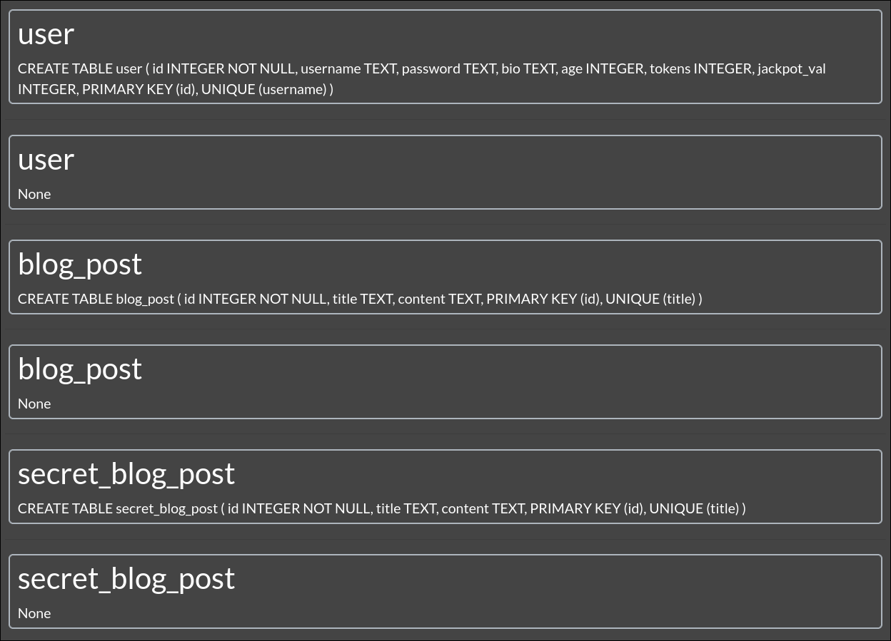

# Challenge `Wow, it can't be more juicy than this!` Writeup

- Vulnerability: SQL injection
- Where: Search blogposts textbox
- Impact: We can execute SQL queries, leading us to discover secret databases as said in the challange (sqlite_master table)

## Steps to Reproduce

1. We know that it is possible to execute queries in the search textbox (see notes). In the challenge, it is mentioned that there is a `sqlite_master` table, which contains columns such as `tbl_name` and `sql`. To exploit this and discover the contents of the tables, we can use the query `' UNION ALL SELECT name, tbl_name, sql FROM sqlite_master; --` to add the contents of the `sqlite_master` table to the search results.
2. The output is , and from this we learn that there is a table named `secret_blog_posts`.
3. Using the same strategy, we run the query `' UNION ALL SELECT id, title, content FROM secret_blog_posts; --`, and the contents of this table are appended to the standard results, displaying the following post: 
4. So, the flag is `SSof{Never_understimate_the_power_of_the_UNION}`

- Note: If we enter `%'` in the search field, the following error will show up: `(sqlite3.OperationalError) near "%": syntax error [SQL: SELECT id, title, content FROM blog_post WHERE title LIKE '%%'%' OR content LIKE '%%'%'] (Background on this error at: https://sqlalche.me/e/14/e3q8)`. This happens because the search bar uses a LIKE query operator, and it is very likely that it automatically adds `%` wildcards to the search input. If we include a single quote (`'`) in the input, it prematurely closes the string in the SQL query, resulting in a syntax error and revealing the full query being executed.

- Note 2: The `UNION` operator in SQL is used to combine the results of two or more SELECT queries into a single result set. In this challenge, it allows us to append the results from another table (such as `sqlite_master` or `secret_blog_posts`) to the standard search results.